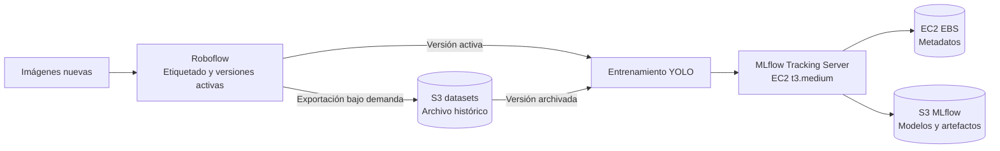
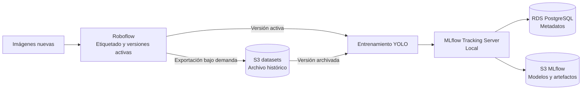
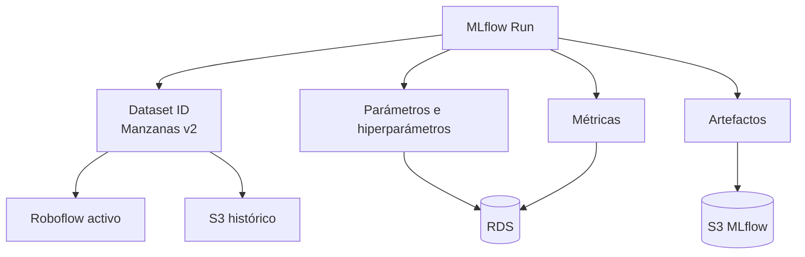
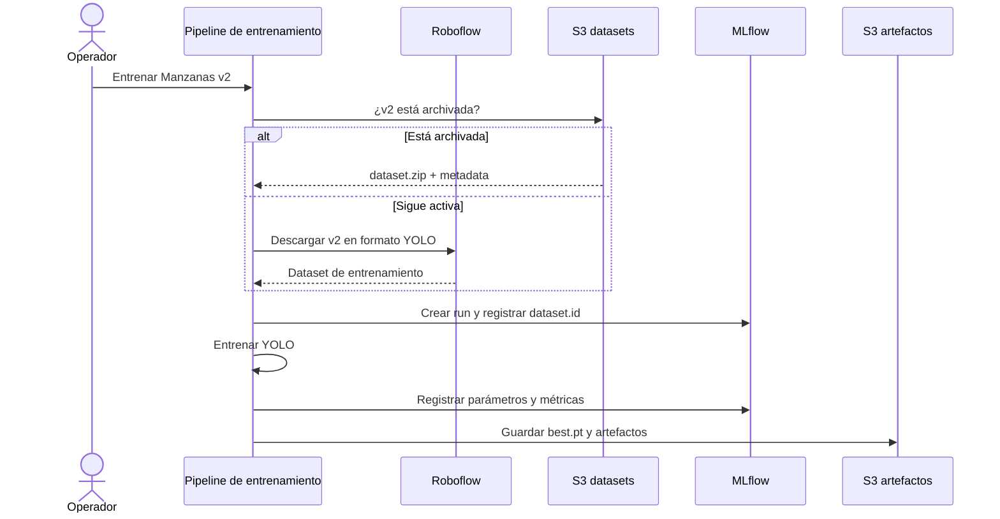
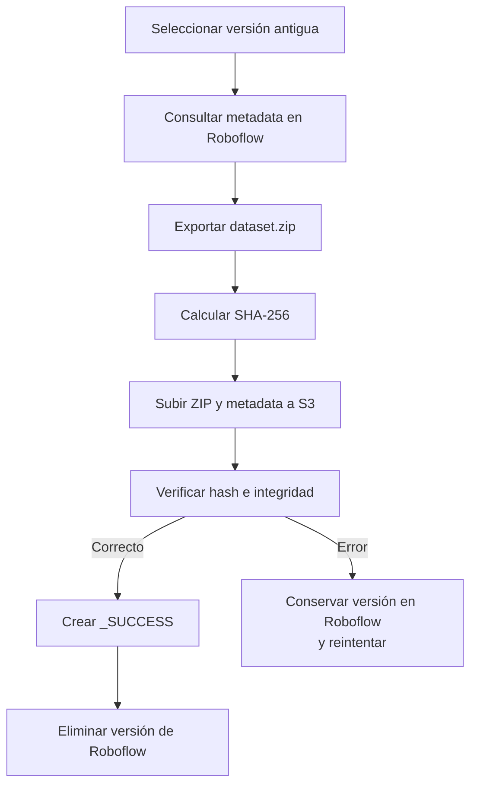

# Arquitectura de trazabilidad para datasets de visión artificial

## 1. Objetivo

Definir una arquitectura sencilla para administrar datasets etiquetados en Roboflow, conservar versiones históricas en Amazon S3 y relacionar cada entrenamiento con sus datos, parámetros, métricas y modelos mediante MLflow.

La solución está diseñada para un equipo donde una sola persona administra el ciclo de visión artificial. Se priorizan:

- pocos pasos manuales;
- capacidad de liberar espacio en Roboflow;
- recuperación de datasets históricos;
- trazabilidad entre dataset, entrenamiento y modelo;
- bajo coste y complejidad operativa.

## 2. Arquitectura propuesta en AWS

### 2.1. Opción seleccionada

La aplicación de MLflow se ejecuta localmente y apunta a RDS PostgreSQL y S3 mediante un usuario IAM con los permisos necesarios. RDS almacena los parámetros y métricas, mientras que S3 almacena los modelos y artefactos.

Se escogio esto por descarte a las soluciones que seran posteriormente presentadas además de que ya fue probada.

La instancia considerada para RDS es una `db.t4g.micro`, con el mínimo de 20 GB de almacenamiento. Con un uso estimado de cinco horas diarias, el coste calculado es de aproximadamente **USD 4.73 mensuales**.

Esta opción se escoge para evitar una EC2 `t3.medium` dedicada únicamente a levantar MLflow.

> Los precios son aproximados y deben validarse según la región y la configuración utilizada.

### 2.2. Posible ejecución en una minicomputadora

Si se dispone de una minicomputadora o Raspberry Pi, la aplicación podría mantenerse activa sin el coste de una EC2. Según las especificaciones evaluadas, una EC2 encendida durante ocho horas diarias costaría aproximadamente **USD 11 mensuales**.

También se podría reemplazar RDS por una base de datos ligera en la Raspberry Pi. 
Esta opción necesita pruebas porque sería necesario analizarlo ya que el entrenamiento ocurre en colab, y la ip fija no es persistente.

### 2.3. Alternativas exploradas

#### EC2 `t3.medium` con EBS

Se evaluó una EC2 `t3.medium` con 20 GB de EBS. Con un uso de diez horas por semana en `us-east-1`, el coste estimado es de aproximadamente **USD 2 mensuales**. La única función de esta instancia sería levantar MLflow.

El principal problema es la recuperación de los datos si se elimina la instancia o el volumen. Puede ser una opción factible si se configura la persistencia del EBS y se realizan backups o snapshots periódicos.



#### EC2 Spot con EBS

Se exploró esta opción por el menor coste de las instancias Spot. El precio observado oscila aproximadamente entre **USD 0.30 por hora** para 16 GB de VRAM y **USD 0.90 por hora** para 24 GB de VRAM.

Se quiso utilizar EBS para almacenar las métricas, pero en la configuración probada, cuando la instancia Spot se detiene o termina, no puede volver a encenderse conservando directamente el mismo entorno y sus datos. Sería necesario crear otra instancia y restaurar o volver a adjuntar el almacenamiento. Por esta razón se descartó como opción para mantener MLflow.

#### Amazon SageMaker

Otra opción es utilizar SageMaker en una instancia mediana y ejecutar entrenamientos fuertes mediante instancias Spot. Esta alternativa todavía necesita pruebas.

### 2.4. Consideraciones operativas y de coste

Para reducir costes se debe apagar RDS cuando no se utiliza y encenderlo antes de cada entrenamiento. Esto puede incrementar el tiempo necesario para iniciar el proceso.

### 2.5. Acceso desde Google Colab

En las pruebas con Google Colab se abrieron los puertos necesarios y se accedió mediante la contraseña de RDS. Esto se debe a que la IP pública de Colab cambia cada vez que la sesión se actualiza o se detiene, lo que obligaría a modificar continuamente las reglas de acceso de RDS.

Esta configuración debe limitarse a pruebas. Para mayor seguridad se debe evaluar un túnel o un servidor MLflow protegido, evitando exponer RDS directamente a Internet.

### 2.6. Principio general

Cada herramienta tiene una responsabilidad específica:

| Componente | Responsabilidad |
|---|---|
| **Roboflow** | Etiquetado, revisión y versionado de datasets activos |
| **S3 de datasets** | Archivo histórico de versiones retiradas o importantes |
| **MLflow** | Seguimiento de experimentos y relación entre dataset, parámetros, métricas y modelo |
| **RDS PostgreSQL** | Backend de MLflow para runs, parámetros, métricas, tags y registro de modelos |
| **S3 de MLflow** | Almacenamiento de `.pt`, gráficas, configuraciones y otros artefactos |
| **Máquina de entrenamiento** | Caché local y ejecución de entrenamientos de visión |



## 3. Ciclo de vida de un dataset

Los datasets tienen dos estados principales.

### 3.1. Estado activo

El proyecto y sus versiones permanecen en Roboflow mientras exista espacio disponible y se continúe trabajando sobre ellos.

```text
Roboflow
└── Manzanas
    ├── v1
    ├── v2
    └── v3
```

En este estado, los entrenamientos pueden descargar directamente una versión explícita de Roboflow.

### 3.2. Estado archivado

Cuando sea necesario liberar espacio, la versión se exporta y se guarda en S3. Después de verificar el archivo, puede eliminarse de Roboflow.
Tambien se puede ir puede ir aplicando por cada cambio o hito importante de ese dataset en particular.

```text
S3
└── empresa
    └── manzanas
        ├── v1
        │   ├── dataset.zip
        │   ├── metadata.json
        │   ├── dataset.sha256
        │   └── _SUCCESS
        └── v2
            ├── dataset.zip
            ├── metadata.json
            ├── dataset.sha256
            └── _SUCCESS
```

El formato utilizado para generar `dataset.zip` se registra en `metadata.json`, pero no forma parte de la identidad lógica del dataset. Las anotaciones pertenecen a la versión de Roboflow y no a una arquitectura de modelo concreta.

## 4. Convención de identidad

Cada versión debe tener un identificador estable:

```text
roboflow://<workspace>/<proyecto>/<versión>
```

Ejemplo:

```text
roboflow://empresa/manzanas/2
```

La ruta correspondiente en S3 es determinista:

```text
s3://empresa-vision-datasets/empresa/manzanas/v2/
```

La identidad permanece igual aunque la misma versión se use con YOLO, Faster R-CNN u otra arquitectura. El formato del archivo empleado para un entrenamiento se registra por separado como `dataset.export_format`.

### 4.1. Separación entre dataset, representación y modelo

La trazabilidad distingue tres conceptos:

| Concepto | Ejemplo | Qué identifica |
|---|---|---|
| Dataset | `roboflow://empresa/manzanas/2` | Imágenes, anotaciones, clases, splits y transformaciones de Roboflow de la versión 2 |
| Representación | `dataset.export_format = yolov8` | Formato de archivos entregado al entrenamiento |
| Modelo | `model.base = yolo11m.pt` | Arquitectura o pesos iniciales empleados |

Por ejemplo, estos runs comparten el mismo dataset:

```text
Run A
├── dataset.id:            roboflow://empresa/manzanas/2
├── dataset.export_format: yolov8
└── model.base:            yolo11m.pt

Run B
├── dataset.id:            roboflow://empresa/manzanas/2
├── dataset.export_format: coco
└── model.base:            fasterrcnn_resnet50_fpn
```

Cambiar de YOLO a Faster R-CNN no crea una nueva versión del dataset. Solo cambia la representación consumida y el modelo entrenado.

Tampoco se deben duplicar las anotaciones en S3 únicamente porque cambió el modelo. Por defecto se archiva una sola copia de la versión:

```text
empresa/manzanas/v2/dataset.zip
```

`metadata.json` indica el formato concreto de esa copia. Si en el futuro se necesita otro formato, puede generarse como una representación derivada, siempre que se conserve una fuente de anotaciones capaz de producirlo. Solo conviene almacenar más de una representación cuando sea necesaria para reproducibilidad exacta o cuando ya no pueda regenerarse después de eliminar la versión de Roboflow.

Esta decisión prioriza **reproducibilidad lógica** —mismas imágenes, anotaciones y splits— sin guardar una copia de labels por cada framework. Para una reproducción byte a byte del entrenamiento sería necesario conservar exactamente la exportación consumida por ese run.

Se recomienda usar nombres normalizados en minúsculas, sin espacios ni caracteres especiales. Si un proyecto se elimina y luego se recrea con el mismo nombre, debe añadirse un identificador o periodo para evitar colisiones:

```text
empresa/manzanas-2026/v1/
```

## 5. Información registrada en MLflow

Cada ejecución debe registrar como mínimo:

| Información | Fuente | Ejemplos |
|---|---|---|
| Imágenes | Roboflow | cantidad total y cantidad por split |
| Augmentations | Roboflow | rotación, recorte, brillo u otras transformaciones configuradas en la versión |
| Preprocesamiento | Roboflow | resize, auto-orient y otras operaciones aplicadas al generar la versión |
| Versión de YOLO | Entorno de entrenamiento | versión instalada de Ultralytics y modelo base utilizado |
| Hiperparámetros | Configuración del entrenamiento | epochs, batch, imgsz, optimizer, learning rate y seed |

MLflow conserva estos datos para poder explicar con qué dataset y configuración se produjo cada modelo. Las imágenes completas no se guardan en RDS: MLflow registra sus cantidades y la referencia a la versión del dataset. El contenido completo permanece en Roboflow o en el bucket histórico de S3.

### 5.1. Identidad del dataset

Solo es necesario mantener como tags consultables los datos esenciales:

```python
mlflow.set_tags({
    "dataset.id": "roboflow://empresa/manzanas/2",
    "dataset.export_format": "yolov8",
    "dataset.archive_uri": (
        "s3://empresa-vision-datasets/"
        "empresa/manzanas/v2/"
    ),
})
```

Cuando la versión ya está archivada y verificada, puede registrarse también:

```python
mlflow.set_tag("dataset.sha256", dataset_sha256)
```

La información detallada puede conservarse como artefacto pequeño:

```python
mlflow.log_dict(roboflow_metadata, "dataset/metadata.json")
```

### 5.2. Parámetros del dataset

Obtenidos de Roboflow:

- cantidad total de imágenes;
- cantidad de imágenes en `train`, `valid` y `test`;
- clases y distribución de imágenes o anotaciones por clase;
- preprocessing configurado en la versión;
- augmentations configuradas o materializadas por Roboflow;
- formato utilizado para exportar el dataset.

Ejemplo conceptual de parámetros y metadata obtenidos de Roboflow:

```python
mlflow.log_params({
    "dataset.images.total": 1000,
    "dataset.images.train": 800,
    "dataset.images.valid": 100,
    "dataset.images.test": 100,
    "dataset.export_format": "yolov8",
})

mlflow.log_dict({
    "preprocessing": roboflow_preprocessing,
    "augmentations": roboflow_augmentations,
    "classes": roboflow_classes,
}, "dataset/roboflow_metadata.json")
```

El detalle de preprocessing y augmentations se guarda como JSON porque puede contener estructuras complejas que no encajan correctamente en un único parámetro de MLflow.

### 5.3. Parámetros del entrenamiento

Obtenidos del entorno y de YOLO:

- versión instalada de Ultralytics/YOLO;
- nombre del modelo o pesos iniciales, por ejemplo `yolo11m.pt`;
- epochs;
- batch size;
- tamaño de imagen;
- optimizer y learning rate;
- seed;
- augmentations dinámicas aplicadas por YOLO durante el entrenamiento, si se utilizan;
- versión de PyTorch, Python y CUDA;
- commit Git del código.

Ejemplo:

```python
import ultralytics

mlflow.set_tags({
    "model.framework": "ultralytics",
    "model.base": "yolo11m.pt",
    "software.ultralytics_version": ultralytics.__version__,
})

mlflow.log_params({
    "train.epochs": 100,
    "train.batch": 16,
    "train.imgsz": 640,
    "train.optimizer": "AdamW",
    "train.learning_rate": 0.001,
    "train.seed": 42,
})
```

> El formato de exportación `yolov8` informado por Roboflow no representa la versión instalada de Ultralytics. Esta debe obtenerse del entorno de entrenamiento.

### 5.4. Métricas y artefactos

RDS almacena los metadatos administrados por MLflow:

- runs;
- parámetros;
- métricas;
- tags;
- referencias a artefactos;
- Model Registry.

S3 almacena los archivos pesados:

- `best.pt`;
- `last.pt`;
- `results.csv`;
- matrices de confusión;
- curvas de evaluación;
- configuraciones;
- ejemplos de predicciones.



## 6. Contenido de una versión archivada

### 6.1. `dataset.zip`

Exportación de Roboflow empleada para entrenamiento. Debe contener como mínimo:

- imágenes;
- etiquetas;
- particiones `train`, `valid` y, si existe, `test`;
- archivo `data.yaml`;
- mapa de clases.

El ZIP simplifica la transferencia y verificación. Su principal objetivo no es comprimir las imágenes, ya que JPEG y PNG normalmente ya están comprimidos.

### 6.2. `metadata.json`

Conserva la información necesaria después de eliminar la versión de Roboflow:

```json
{
  "dataset_id": "roboflow://empresa/manzanas/2",
  "workspace": "empresa",
  "project": "manzanas",
  "roboflow_version": 2,
  "export_format": "yolov8",
  "exported_at": "2026-09-24T18:30:00Z",
  "sha256": "4378b890...",
  "size_bytes": 538492034,
  "classes": [
    "manzana-roja",
    "manzana-verde"
  ],
  "splits": {
    "train": 800,
    "valid": 100,
    "test": 100
  },
  "preprocessing": {},
  "roboflow_augmentation": {}
}
```

### 6.3. `dataset.sha256`

Contiene la huella criptográfica del ZIP:

```text
4378b890...  dataset.zip
```

Permite detectar archivos incompletos o modificados.

### 6.4. `_SUCCESS`

Se crea únicamente después de comprobar que:

1. el ZIP terminó de subirse;
2. el hash local coincide con el archivo almacenado;
3. el ZIP puede abrirse correctamente;
4. `metadata.json` y `dataset.sha256` existen.

Su presencia significa que la versión puede eliminarse de Roboflow de manera segura.

## 7. Flujo de entrenamiento

El operador indica una versión de Roboflow. El sistema registra la versión concreta; no conserva solamente la palabra `latest`.



Para la operación diaria, el flujo debería exponerse como un único comando:

```powershell
python train.py --project manzanas --version 2
```

## 8. Flujo para liberar espacio en Roboflow

El archivado se ejecuta cuando sea necesario liberar espacio, no obligatoriamente después de cada entrenamiento exploratorio.



Comando operativo propuesto:

```powershell
python archive_dataset.py --project manzanas --version 1
```

Por seguridad, inicialmente el script debería verificar y marcar la versión como segura, pero dejar la eliminación de Roboflow como acción manual.

## 9. Política de archivado

| Tipo de versión | Momento de archivado | Retención sugerida |
|---|---|---|
| Prueba descartable | Cuando falte espacio o no archivar | Temporal |
| Experimento relevante | Al decidir conservar el run | Largo plazo |
| Candidato a producción | Antes de promover el modelo | Largo plazo |
| Modelo en producción | Obligatorio y verificado | Permanente |

Una versión de producción nunca debe depender exclusivamente de Roboflow.

## 10. Política de almacenamiento en S3

Se recomienda separar datasets y artefactos:

```text
s3://empresa-vision-datasets/
s3://empresa-mlflow-artifacts/
```

Configuración mínima para el bucket de datasets:

- bloqueo completo de acceso público;
- cifrado en reposo;
- S3 Versioning;
- `force_destroy = false` en Terraform;
- permisos de escritura limitados al proceso de archivado;
- alarmas de presupuesto;
- lifecycle para versiones antiguas.

Política inicial sugerida:

```text
0–90 días       → S3 Standard
Después de 90   → Glacier Flexible Retrieval
Expiración      → ninguna para datasets productivos
```

Antes de usar Glacier deben considerarse los tiempos, costes de recuperación y periodos mínimos de almacenamiento.

## 11. Consideraciones de espacio

S3 no deduplica el contenido entre ZIP diferentes. Si cada versión contiene casi todas las imágenes anteriores, habrá duplicación:

```text
v1: 10 GB
v2: 11 GB
v3: 12 GB
Total almacenado: 33 GB
```

Para el volumen inicial se acepta esta duplicación a cambio de una arquitectura simple y snapshots fáciles de recuperar. Solo se evaluará almacenamiento por objetos y manifiestos cuando ocurra alguno de estos casos:

- cientos de versiones;
- más de aproximadamente 500 GB–1 TB;
- costes relevantes de transferencia;
- alta repetición de imágenes entre proyectos;
- necesidad de componer datasets desde múltiples fuentes.

La caché local debe reutilizar datasets descargados para evitar transferencias repetidas desde S3.

## 12. Separación de augmentations

Se deben distinguir dos conceptos:

### Augmentations de Roboflow

Forman parte de la versión del dataset y pueden estar materializadas en la exportación:

```text
dataset.roboflow_augmentation
```

### Augmentations de YOLO

Se aplican dinámicamente durante cada entrenamiento y pertenecen a los hiperparámetros del run:

```text
train.augmentation
```

Dos entrenamientos pueden utilizar el mismo ZIP y producir resultados diferentes al cambiar las augmentations de YOLO.

## 13. Recuperación de una versión histórica

Para reproducir un entrenamiento antiguo:

1. localizar el run en MLflow;
2. consultar `dataset.id` y `dataset.archive_uri`;
3. descargar `dataset.zip` desde S3;
4. verificar `dataset.sha256`;
5. restaurar el commit Git y el entorno registrados;
6. ejecutar los parámetros del run;
7. comparar los resultados obtenidos.

El modelo `.pt` puede seguir utilizándose aunque se pierda el dataset, pero sin el dataset no será posible repetir, auditar o comparar correctamente el entrenamiento.

## 14. Lista de verificación antes de eliminar de Roboflow

- [ ] `dataset.zip` existe en S3.
- [ ] `metadata.json` contiene clases, splits, preprocessing y augmentations.
- [ ] `dataset.sha256` coincide con el ZIP.
- [ ] El ZIP se abre correctamente.
- [ ] Existe el marcador `_SUCCESS`.
- [ ] MLflow registra el `dataset.id` correcto.
- [ ] La ruta de S3 coincide con proyecto, versión y formato.
- [ ] Si el modelo está en producción, la retención del dataset está protegida.

## 15. Decisiones actuales

1. Roboflow continuará siendo la herramienta para datasets activos.
2. S3 funcionará como archivo histórico cuando sea necesario liberar espacio.
3. No se implementará deduplicación inicialmente.
4. Cada versión se almacenará como un ZIP independiente.
5. MLflow relacionará cada run con una versión explícita del dataset.
6. RDS almacenará los metadatos de MLflow.
7. Los modelos `.pt` y demás artefactos se almacenarán en S3 mediante MLflow.
8. Los datasets de modelos productivos se archivarán antes de promoverlos.
9. Ninguna versión se eliminará de Roboflow sin verificar primero su copia en S3.

## 16. Mejoras futuras opcionales

Estas mejoras no son necesarias para la primera versión:

- automatizar la eliminación de Roboflow después de `_SUCCESS`;
- implementar un catálogo central de datasets;
- usar almacenamiento por contenido y manifiestos para deduplicar;
- añadir validaciones avanzadas de duplicados y fuga entre splits;
- automatizar promoción de modelos con MLflow Model Registry;
- añadir un orquestador si aumenta el número de pipelines.

La arquitectura inicial debe mantenerse sencilla hasta que el volumen o la operación demuestren la necesidad de estas mejoras.
